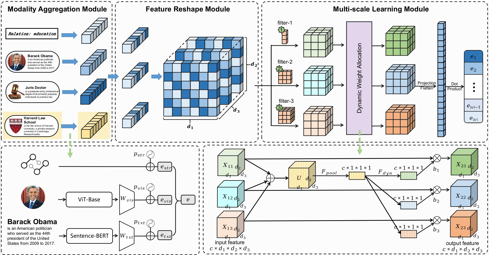

<h1 align="center">
  MuHE
</h1>

<h4 align="center">MuHE: Multimodal Hyper-Relational Knowledge Graph Embedding with Multi-scale Convolutional Network</h4>

<h2 align="center">
  Overview of MuHE
  
</h2>


This paper has been submitted to the TKDE.

## Requirements

The version of Python and major packages needed to run the code:

```\
-- python 3.9.16
-- torch(gpu) 1.12.0
-- numpy 1.26.0
-- tqdm 4.65.0
```

## Dataset

- We use (M-H) JF17K, (M-H) WikiPeople, and (M-H) FB-AUTO dataset for knowledge hypergraph link prediction. 
- All the preprocessed data are included in the `./data` directory.

## Results:

The results are:

|  Dataset   |  MRR  |  H@1  |  H@3  | H@10  |
| :--------: | :---: | :---: | :---: | :---: |
|   JF17K    | 0.590 | 0.513 | 0.619 | 0.736 |
| WikiPeople | 0.477 | 0.403 | 0.513 | 0.614 |
|  FB-AUTO   | 0.914 | 0.897 | 0.927 | 0.945 |

## How to Run

```
python main-JF17K.py                 ## (M-H) JF17K dataset
python main-WikiPeople.py            ## (M-H) WikiPeople dataset
python main-FB-AUTO.py               ## (M-H) FB-AUTO dataset
```

## Supplementary Note

We support flexible setting of hyperparameters that affect the training performance of MuHE models: **batch_size、 learning rate and decay rate**.

It is worth mentioning that **emb_dropout, vis_dropout, and txt_dropout** are also hyperparameters that affect the final performance of the model. We have provided default parameters in the corresponding Python files for the three datasets.

